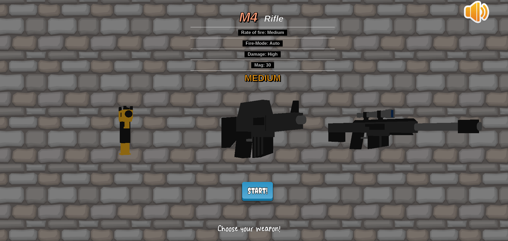
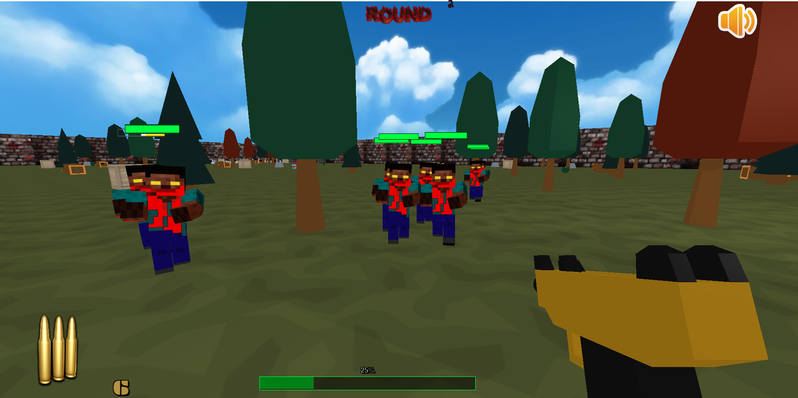

# Zombie Horde 🧟🧟🧟

Zombie Horde is a Three.js browser game started as final homework for Interactive Graphics course at Sapienza University of Rome. Feel free to pull and contribute!

**PLAY IT HERE**: https://giuppouni.github.io/3jsZombieHorde/

## Getting Started
We used Three.js, Cannon.js and jQuery.  

### Prerequisites
To run:
  common browser (Chrome, Firefox, ...) recent versions. 

To develop:
- Three js
- Cannon js
- jQuery

### Installing
You need a local server running because some browsers (Chrome, Firefox...) will block loading of elements (textures, images, models...).
A good example for Ubutnu is live-server on CLI or python simpleHTTPServer.

## Deployment
We used Github pages to deploy the code.

## Built With

* [ThreeJs](http://www.http://threejs.org/) - The web framework used
* [CannonJs](https://github.com/schteppe/cannon.js?)
* [KenneyAssets](https://www.kenney.nl/assets)

## TODO
- fix character shadow (now it's a box)
- fix ball trajectory when shooting in free Aim 
- fix css layout and colors
- add real rounds models instead of balls (opt)
- enlarge game field
- add more meshes and TEXTURES (introducing simple mesh with nice textures instead of models)
- SOMETIME ZOMBIES GO THROUGH OBJECT OR CAN PUSH OBJECT WITH A VERY BIG MASS

## DevNotes
Notes for developers:
ZOMBIE BONES SCHEMA

bones[1] - R LEG 			
bones[4] - L LEG
bones[7] - Torso
bones[8] - Torso
bones[9] - Head

bones[11] - up arm right
bones[12] - low arm right
bones[14] - up arm left
bones[15] - low arm left

## Authors
 
* **Giuseppe Capaldi** - [GiuseppeCapaldi](https://github.com/GiuppoUni)
* **Davide Lo Iudice** - [DavideLoIudice](https://github.com/LinguaggioScalabile)

## License

This project is licensed under the MIT License - see the [LICENSE.md](LICENSE.md) file for details
